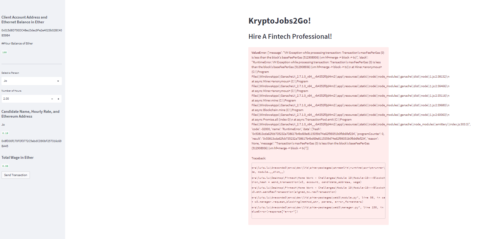

## Module 19 - Block Chain Wallet

Programme has been developed and deployed using streamlit. However, I had encounter an error for sending transaction. The error seems with web3\module.py and web3\manager.py. We have nto learned how to solve web3 problems. 

I tried to ask around on Stackflow etc.. No solution has been found. 

I have gone through both programmes against the class solved programmes, but have nto foudn any issues with the programme. Both programmes seem correct. 

# Implementation Screenshots

1. Deployment of the programme using streamlit run command

2. Try to send transaction, but it comes up with an error.

# Willing to Hear Help if You Know How to Solve the Above Issues. 

I'll continue to search for solutions after this assignment. 

